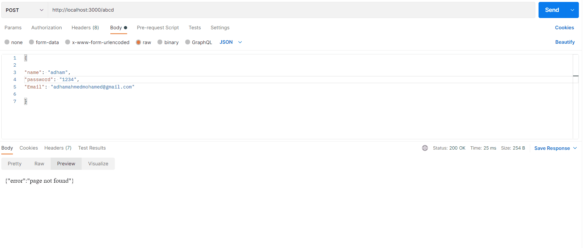

requird in this lab
____________________

Create server  

has some endpoints  

login  ,signup  ,home page  ,profile  

Post: 
using post man /sign-up  

            payload -> email, password, username and store it in file  

using postman /login  

            payload -> email, password 

Login and Signup: 

You will check it from the file if you have the same email and password 

  

Handling cases: 

            Login: 

if I send correct password and email redirect me to profile with my name  

if I send wrong password return, 400 in header with msg you entered wrong password  

if I send wrong email, return 400 in header with msg you entered wrong email  

If I send an email that doesn’t exist, return 400 headers with msg you entered email doesn’t exist please signup 

Signup: 

                        If I send exist email, return the email already exist 

if I tried to open URL doesn’t exist return 404 not found  

 
